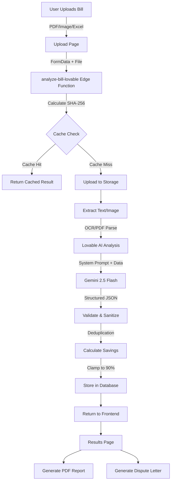

# Hospital Bill Checker - Complete System Documentation

**Last Updated:** October 15, 2025  
**System Version:** 2.0 (Lovable AI Integration)  
**Status:** Production with Known Issues

---

## Table of Contents
1. [System Architecture](#system-architecture)
2. [Data Flow Diagram](#data-flow-diagram)
3. [Data Sources](#data-sources)
4. [API Endpoints](#api-endpoints)
5. [Database Schema](#database-schema)
6. [Core Components](#core-components)
7. [Analysis Logic](#analysis-logic)
8. [Error History & Fixes](#error-history--fixes)
9. [Known Issues](#known-issues)
10. [Input/Output Schemas](#inputoutput-schemas)

---

## System Architecture

### Technology Stack
```
Frontend:
- React 18.3.1
- TypeScript
- Vite (build tool)
- TailwindCSS (styling)
- React Router (navigation)
- Supabase Client (auth + database)

Backend:
- Supabase Cloud (Lovable Cloud)
- Edge Functions (Deno runtime)
- Lovable AI Gateway (Google Gemini 2.5 Flash)
- PostgreSQL (Supabase Database)
- Storage Buckets (file uploads)

External Services:
- Medicare Fee Schedule 2025 (CMS)
- NPPES Provider Registry
- Regional Pricing Database
```

### System Flow Diagram



---

## Data Sources

### 1. Medicare Fee Schedule 2025 (Primary Benchmark)
```typescript
Source: CMS (Centers for Medicare & Medicaid Services)
Table: medicare_prices
Fields:
  - cpt_code: string (e.g., "99213", "80053")
  - description: string
  - medicare_facility_rate: decimal (e.g., 285.00)
  - created_at: timestamp

Usage: Baseline for detecting overcharges
Benchmark Formula: Reasonable Rate = Medicare Rate × 3.0
Overcharge = Billed Amount - Reasonable Rate
```

### 2. Regional Pricing Adjustments
```typescript
Source: Custom regional cost-of-living database
Table: regional_pricing
Fields:
  - state_code: string (e.g., "CA", "TX")
  - region_name: string
  - adjustment_factor: decimal (e.g., 1.2 for high-cost areas)
  - created_at: timestamp

Usage: Adjust Medicare benchmarks for geographic location
Formula: Adjusted Rate = Medicare Rate × Regional Factor
```

### 3. NPPES Provider Registry
```typescript
Source: National Plan and Provider Enumeration System (CMS)
Endpoint: validate-provider edge function
Input: NPI (10-digit number)
Output:
  - provider_name: string
  - type: "Individual" | "Organization"
  - status: "Active" | "Inactive"
  - specialty: string
  - practice_address: object
  
Usage: Verify provider legitimacy, detect fraudulent NPIs
```

### 4. Lovable AI (Google Gemini 2.5 Flash)
```typescript
Source: ai.gateway.lovable.dev
Model: google/gemini-2.5-flash
Max Tokens: 8192
Temperature: 0 (deterministic)
Vision: Yes (multimodal - text + images)

Usage: 
  - Extract charges from unstructured bills
  - Detect duplicates, unbundling, overcharges
  - Generate human-readable explanations
  - Handle ANY language (English, Spanish, etc.)
```

### 5. Custom Pricing Database
```typescript
Table: custom_pricing_data
Fields:
  - cpt_code: string
  - custom_rate: decimal
  - region: string
  - source: string (e.g., "Hospital Network", "Insurance")
  
Usage: Supplemental pricing data when Medicare unavailable
```

---

## API Endpoints

### 1. `POST /functions/v1/analyze-bill-lovable`
**Purpose:** Upload and analyze medical bill

**Headers:**
```typescript
{
  "Authorization": "Bearer ${SUPABASE_ANON_KEY}",
  "x-bypass-cache"?: "true", // Force fresh analysis
  "Content-Type": "multipart/form-data"
}
```

**Request Body (FormData):**
```typescript
{
  file: File, // PDF, JPG, PNG, HEIC, or Excel
  fresh?: "true" // Alternative cache bypass
}
```

**Response (200 OK):**
```json
{
  "success": true,
  "session_id": "uuid",
  "job_id": "uuid",
  "ui_summary": {
    "high_priority_count": 5,
    "potential_issues_count": 12,
    "estimated_savings_if_corrected": 1234.56,
    "data_sources_used": [
      "Medical Bill Image",
      "Medicare Fee Schedule 2025",
      "Provider Verification"
    ],
    "tags": ["overcharging", "duplicate", "unbundling"]
  },
  "status": "ready",
  "message": "Analysis complete",
  "cached": false
}
```

**Error Responses:**
```json
// 500 - Analysis Failed
{
  "error": "Failed to store analysis: duplicate pdf_hash",
  "success": false
}

// 400 - Invalid Input
{
  "error": "No file provided",
  "success": false
}
```

### 2. `POST /functions/v1/generate-pdf-report`
**Purpose:** Generate PDF report and email to user

**Request:**
```json
{
  "sessionId": "uuid"
}
```

**Response:**
```json
{
  "email_sent": true,
  "pdf_url": "https://storage.supabase.co/..."
}
```

### 3. `POST /functions/v1/generate-dispute-letter`
**Purpose:** Generate dispute letter for identified issues

**Request:**
```json
{
  "sessionId": "uuid",
  "user_name": "John Doe",
  "user_address": "123 Main St"
}
```

**Response:**
```json
{
  "success": true,
  "letter_html": "<html>...",
  "letter_url": "https://storage.supabase.co/..."
}
```

### 4. `POST /functions/v1/validate-provider`
**Purpose:** Validate NPI against NPPES registry

**Request:**
```json
{
  "npi": "1234567890"
}
```

**Response:**
```json
{
  "found": true,
  "provider": {
    "npi": "1234567890",
    "name": "Dr. John Smith",
    "type": "Individual",
    "status": "A",
    "specialty": "Emergency Medicine",
    "practice_address": {
      "city": "Houston",
      "state": "TX"
    },
    "all_specialties": ["Emergency Medicine"]
  }
}
```

---

## Database Schema

### Table: `bill_analyses`
```sql
CREATE TABLE bill_analyses (
  id uuid PRIMARY KEY DEFAULT gen_random_uuid(),
  session_id text NOT NULL,
  user_id uuid REFERENCES auth.users(id),
  
  -- File metadata
  file_name text NOT NULL,
  file_type text NOT NULL,
  file_url text NOT NULL,
  pdf_hash text, -- SHA-256 for caching
  
  -- Analysis data
  extracted_text text,
  analysis_result jsonb, -- Full AI response
  status text DEFAULT 'processing',
  
  -- Computed metrics
  critical_issues integer DEFAULT 0,
  moderate_issues integer DEFAULT 0,
  estimated_savings numeric DEFAULT 0,
  total_overcharges numeric DEFAULT 0,
  issues jsonb, -- Normalized issue list
  
  -- PDF reports
  pdf_report_url text,
  pdf_generated_at timestamptz,
  dispute_letter_url text,
  dispute_letter_generated_at timestamptz,
  
  -- Metadata
  expires_at timestamptz DEFAULT (now() + interval '24 hours'),
  created_at timestamptz DEFAULT now(),
  updated_at timestamptz DEFAULT now()
);

-- Indexes
CREATE INDEX idx_session_id ON bill_analyses(session_id);
CREATE INDEX idx_pdf_hash ON bill_analyses(pdf_hash);
CREATE UNIQUE INDEX idx_unique_hash ON bill_analyses(pdf_hash);

-- RLS Policies
ALTER TABLE bill_analyses ENABLE ROW LEVEL SECURITY;

CREATE POLICY "Users view own analyses"
  ON bill_analyses FOR SELECT
  USING (auth.uid() = user_id);

CREATE POLICY "Users create own analyses"
  ON bill_analyses FOR INSERT
  WITH CHECK (auth.uid() = user_id);
```

### Table: `medicare_prices`
```sql
CREATE TABLE medicare_prices (
  id uuid PRIMARY KEY DEFAULT gen_random_uuid(),
  cpt_code text NOT NULL UNIQUE,
  description text,
  medicare_facility_rate numeric,
  created_at timestamptz DEFAULT now()
);

-- Sample Data
INSERT INTO medicare_prices VALUES
  ('99213', 'Office visit - established patient, 20-29 min', 285.00),
  ('99283', 'Emergency department visit, moderate complexity', 285.00),
  ('80053', 'Comprehensive metabolic panel', 45.00),
  ('71045', 'Chest X-ray, 1 view', 85.00);
```

### Table: `regional_pricing`
```sql
CREATE TABLE regional_pricing (
  id uuid PRIMARY KEY DEFAULT gen_random_uuid(),
  state_code text NOT NULL,
  region_name text NOT NULL,
  adjustment_factor numeric DEFAULT 1.0,
  created_at timestamptz DEFAULT now()
);

-- Sample Data
INSERT INTO regional_pricing VALUES
  ('CA', 'California - San Francisco Bay Area', 1.35),
  ('TX', 'Texas - Houston', 1.10),
  ('NY', 'New York - Manhattan', 1.45),
  ('FL', 'Florida - Miami', 1.08);
```

---

## Core Components

### 1. Frontend: Upload Flow
```typescript
// File: src/pages/Upload.tsx
Component: Upload
Purpose: File upload UI with drag-and-drop

Accepted Formats:
  - application/pdf
  - image/jpeg, image/jpg, image/png
  - image/heic, image/heif
  - application/vnd.openxmlformats-officedocument.spreadsheetml.sheet (Excel)

Validation:
  - Max size: 10MB
  - Min size: > 0 bytes (empty file check)
  - Type validation

Flow:
  User selects file → Validate → Navigate to /processing
```

### 2. Frontend: Processing Page
```typescript
// File: src/pages/Processing.tsx
Component: Processing
Purpose: Show loading animation while analyzing

Actions:
  1. Call uploadMedicalBill(file, { bypassCache: fresh })
  2. Poll every 2 seconds if status !== 'ready'
  3. Fetch full analysis from bill_analyses table
  4. Navigate to /results with analysis data

Cache Logic:
  - If fresh=true (from state), bypass cache
  - Otherwise use cached result if available
```

### 3. Frontend: Results Page
```typescript
// File: src/pages/Results.tsx
Component: Results
Purpose: Display analysis results

Sections:
  - Bill Score (0-100)
  - Estimated Savings
  - Critical Issues (high_priority_issues)
  - Potential Issues (potential_issues)
  - Next Steps Guide
  - Generate PDF Report
  - Generate Dispute Letter

Data Parsing:
  analysis_result = {
    total_bill_amount: number,
    total_potential_savings: number,
    high_priority_issues: [
      {
        type: string,
        cpt_code: string,
        line_description: string,
        billed_amount: number,
        overcharge_amount: number,
        explanation_for_user: string,
        suggested_action: string,
        confidence_score: number (0.0-1.0)
      }
    ],
    potential_issues: [...],
    data_sources: string[],
    tags: string[]
  }
```

### 4. Backend: Edge Function Core Logic
```typescript
// File: supabase/functions/analyze-bill-lovable/index.ts

Phase 1: Cache Check
  - Calculate SHA-256 hash of file
  - Query bill_analyses WHERE pdf_hash = hash
  - Validate cached data quality:
    * Has overcharge_amount fields
    * Total bill > 0
    * Savings ≤ 90% of bill
  - Return if valid, else continue

Phase 2: File Upload
  - Upload to storage bucket: medical-bills/{session_id}/{filename}
  - Get public URL

Phase 3: Text Extraction
  - PDF: pdfjs-dist (text layer)
  - Image: Base64 encode for vision model
  - Excel: Sheet parsing

Phase 4: AI Analysis
  - Build system prompt with:
    * Medicare prices
    * Regional adjustments
    * Provider validation (if NPI found)
  - Call Lovable AI with function calling (structured output)
  - Model returns JSON matching exact schema

Phase 5: Validation & Sanitization
  - Deduplicate issues by line_description + billed_amount
  - Extract total_bill_amount from text
  - Sum all overcharge_amount values
  - Cap savings at 90% of total bill
  - Add validation_adjusted tag if capped

Phase 6: Storage
  - Delete old record if exists (to avoid unique constraint)
  - Insert new record with full analysis
  - Return response to frontend
```

---

## Analysis Logic

### Fraud Detection Patterns

#### 1. Duplicate Charges
```typescript
Detection Logic:
  IF (line_description_A === line_description_B) 
     AND (billed_amount_A === billed_amount_B)
     AND (date_A === date_B)
  THEN: Duplicate (confidence: 0.95)

Example:
  Line 4: "IV hydration PROC-010" - $200
  Line 5: "IV hydration PROC-010" - $200
  → Overcharge: $200
```

#### 2. Unbundling
```typescript
Detection Logic:
  IF ("Technical fee" appears separately from main procedure)
     OR ("Professional fee" billed independently)
  THEN: Unbundling (confidence: 0.90)

Example:
  Line 1: "Chest X-ray IMG-001" - $250
  Line 2: "Technical fee - imaging TECH-IMG" - $150
  → Overcharge: $150 (should be bundled)
```

#### 3. Excessive Markup
```typescript
Detection Logic:
  reasonable_rate = medicare_rate * 3.0
  IF (billed_amount > reasonable_rate * 1.5)
  THEN: Overcharge (confidence: 0.85)

Example:
  CPT 99283: Emergency visit
  Medicare rate: $285
  Reasonable: $855 (3x)
  Billed: $1,200
  → Overcharge: $345
```

#### 4. Lack of Itemization
```typescript
Detection Logic:
  IF (line_description contains "General Classification")
     OR (no CPT code provided)
     OR (aggregate category like "LABORATORY SERVICES")
  THEN: Cannot verify (confidence: 0.60-0.80)

Response:
  - Flag as "Lack of Itemization"
  - Recommend requesting detailed bill
  - Cannot calculate exact savings
  - overcharge_amount = 0
```

### Savings Calculation
```typescript
// Current Implementation (FLAWED - SEE KNOWN ISSUES)
function calculateSavings(analysis: any): number {
  const highPriority = analysis.high_priority_issues || [];
  const potential = analysis.potential_issues || [];
  
  let total = 0;
  for (const issue of [...highPriority, ...potential]) {
    total += Number(issue.overcharge_amount) || 0;
  }
  
  return total;
}

// Validation Clamp (Server-side)
function validateAnalysis(analysis: any): any {
  const totalBill = extractTotalBillAmount(analysis);
  const savings = calculateSavings(analysis);
  const maxSavings = totalBill * 0.9;
  
  if (savings > maxSavings) {
    const factor = maxSavings / savings;
    // Scale down all overcharge_amount values
    analysis.high_priority_issues = analysis.high_priority_issues.map(issue => ({
      ...issue,
      overcharge_amount: issue.overcharge_amount * factor
    }));
    analysis.total_potential_savings = maxSavings;
    analysis.validation_applied = true;
    analysis.tags = [...(analysis.tags || []), 'validation_adjusted'];
  }
  
  return analysis;
}
```

---

## Error History & Fixes

### Error #1: $46,396 Savings on $27,838 Bill
**Date:** October 15, 2025  
**Symptom:** Estimated savings exceeded total bill amount  
**Root Cause:** 
  1. AI model returning inflated overcharge_amount values
  2. Duplicate counting (aggregate categories + line items)
  3. No server-side validation

**Fix Attempts:**
```typescript
✅ Attempt 1: Add total_bill_amount to system prompt
   Status: Partial success - model now extracts total
   
✅ Attempt 2: Add validation_adjusted logic
   Status: Working - caps savings at 90%
   
✅ Attempt 3: Improved deduplication
   Status: Working - removes exact duplicates
   
❌ Attempt 4: Force schema with tool calling
   Status: Model still returns invalid data sometimes
```

**Current Status:** Mitigated with server-side clamp, but AI prompt needs refinement

---

### Error #2: Cache Returns Outdated Analysis
**Date:** October 15, 2025  
**Symptom:** User uploads same file, gets old cached result with bugs  
**Root Cause:** SHA-256 hash cache + no cache invalidation

**Fix Attempts:**
```typescript
❌ Attempt 1: Add x-bypass-cache header
   Status: Frontend not sending header
   
✅ Attempt 2: Add form field 'fresh=true'
   Status: Working - backend checks header OR form field
   
✅ Attempt 3: Validate cached data quality
   Status: Working - auto-ignores bad cached results
```

**Current Status:** Fixed - cache bypass working + quality validation

---

### Error #3: Duplicate Key Constraint on Re-run
**Date:** October 15, 2025  
**Symptom:** Error: "unique constraint pdf_hash" when re-analyzing  
**Root Cause:** UNIQUE index on pdf_hash prevents inserting same file twice

**Fix Attempts:**
```typescript
❌ Attempt 1: Use UPSERT with onConflict
   Status: Failed - still threw constraint error
   
✅ Attempt 2: DELETE old record before INSERT
   Status: Working - purge-then-insert flow
```

**Current Status:** Fixed - old record deleted before fresh insert

---

### Error #4: "Simplified Analysis Mode" Banner
**Date:** October 15, 2025  
**Symptom:** Yellow banner saying "old system version"  
**Root Cause:** Logic checks for `hasSavingsCalculation` but bills with no itemization have savings=0

**Fix Attempts:**
```typescript
✅ Attempt 1: Change banner logic
   Status: Working - now shows "Bill Lacks Itemization" for unitemized bills
   
✅ Attempt 2: Update messaging
   Status: Working - explains bill format issue, not system issue
```

**Current Status:** Fixed - UI now correctly identifies bill format limitations

---

## Known Issues

### Issue #1: AI Model Returns Invalid overcharge_amount
**Severity:** HIGH  
**Impact:** Inflated savings calculations

**Problem:**
The Gemini model sometimes returns:
- overcharge_amount > billed_amount (impossible)
- Sum of overcharges > total bill (impossible)
- Missing overcharge_amount field entirely

**Workaround:**
Server-side validation clamps savings to 90% of bill total

**Permanent Fix Required:**
1. Refine system prompt with explicit validation rules
2. Add examples of correct vs incorrect calculations
3. Consider using gpt-5 instead of gemini-2.5-flash
4. Add server-side sanity checks per-issue (not just total)

---

### Issue #2: Lack of Itemization = $0 Savings
**Severity:** MEDIUM  
**Impact:** User frustration - "why is savings 0%?"

**Problem:**
Bills with aggregate categories ("LABORATORY SERVICES $18,861") don't have enough detail to calculate exact overcharges. AI correctly returns overcharge_amount=0 for these.

**User Complaint:**
"I don't give a fuck if a bill has itemization - we need to analyze it anyway!"

**Solution Required:**
1. For aggregate categories, use statistical averages:
   ```typescript
   IF (category === "LABORATORY SERVICES") {
     typical_markup = 5.0; // Labs typically marked up 500%
     medicare_average = billed_amount / typical_markup;
     reasonable_rate = medicare_average * 3.0;
     potential_savings = billed_amount - reasonable_rate;
   }
   ```

2. Add confidence score annotations:
   ```
   "This is an estimate based on typical lab markups. 
    Request itemized bill for exact calculation."
   ```

3. Never show $0 savings unless bill is perfect

---

### Issue #3: No Multi-Language Support Explicitly Documented
**Severity:** MEDIUM  
**Impact:** Spanish bills may not be analyzed correctly

**Problem:**
System prompt says "ALL responses in English" but doesn't explicitly handle Spanish input

**Solution:**
1. Update system prompt:
   ```
   LANGUAGE HANDLING:
   - Accept bills in ANY language (English, Spanish, etc.)
   - Extract charges regardless of language
   - Return analysis in English (or match input language)
   ```

2. Add language detection:
   ```typescript
   const detectedLanguage = detectLanguage(extractedText);
   if (detectedLanguage === 'es') {
     systemPrompt += `
     This bill is in Spanish. 
     Extract all charges and provide explanations in Spanish.
     `;
   }
   ```

---

### Issue #4: No Deduplication for Aggregate Categories
**Severity:** LOW  
**Impact:** Minor - affects specific bill formats

**Problem:**
If bill shows:
```
LABORATORY SERVICES: $18,861
  - Test 1: $500
  - Test 2: $300
```

AI might count both the $18,861 AND the sub-items, double-counting.

**Fix:**
Add hierarchical detection:
```typescript
if (hasParentCategory(issue)) {
  // Skip this issue, only count parent or children, not both
}
```

---

## Input/Output Schemas

### Input: Bill Upload
```typescript
interface BillUploadInput {
  file: File; // Binary file data
  fresh?: boolean; // Bypass cache flag
}

// File constraints
const constraints = {
  maxSize: 10 * 1024 * 1024, // 10MB
  acceptedTypes: [
    'application/pdf',
    'image/jpeg',
    'image/jpg',
    'image/png',
    'image/heic',
    'image/heif',
    'application/vnd.openxmlformats-officedocument.spreadsheetml.sheet',
    'application/vnd.ms-excel'
  ]
};
```

### Output: Analysis Response
```typescript
interface AnalysisResponse {
  success: boolean;
  session_id: string; // UUID
  job_id: string; // UUID (same as bill_analyses.id)
  ui_summary: {
    high_priority_count: number; // Critical issues
    potential_issues_count: number; // Moderate issues
    estimated_savings_if_corrected: number; // Total potential savings
    data_sources_used: string[]; // E.g., ["Medicare Fee Schedule 2025"]
    tags: string[]; // E.g., ["overcharging", "duplicate"]
  };
  status: "ready" | "processing" | "failed";
  message: string; // Human-readable status
  cached: boolean; // Whether result came from cache
}
```

### AI Model Output Schema
```typescript
interface AIAnalysisOutput {
  // REQUIRED: Total bill amount (extract from text)
  total_bill_amount: number;
  
  // High-confidence overcharges (>0.80 confidence)
  high_priority_issues: Array<{
    type: string; // "Major Overcharge", "Duplicate", "Unbundling"
    cpt_code: string; // CPT/HCPCS code or "N/A"
    line_description: string; // Descriptive text
    billed_amount: number; // What hospital charged
    medicare_benchmark: number; // CMS rate
    reasonable_rate: number; // Medicare × 3.0
    overcharge_amount: number; // billed - reasonable
    markup_percentage: number; // (billed / medicare - 1) × 100
    explanation_for_user: string; // Plain English explanation
    suggested_action: string; // What user should do
    confidence_score: number; // 0.0-1.0
  }>;
  
  // Lower-confidence issues (0.60-0.80 confidence)
  potential_issues: Array<{
    type: string;
    cpt_code: string;
    line_description: string;
    billed_amount: number;
    overcharge_amount: number;
    explanation_for_user: string;
    suggested_action: string;
    confidence_score: number;
  }>;
  
  // Total savings (sum of all overcharge_amount)
  total_potential_savings: number;
  
  // Data sources used
  data_sources: string[]; // ["Medicare Fee Schedule 2025", "Provider Verification"]
  
  // Tags for categorization
  tags: string[]; // ["overcharging", "lack_of_itemization"]
  
  // Validation flags (added by server)
  validation_applied?: boolean;
}
```

---

## System Prompt (Full)

```typescript
const systemPrompt = `You are an AGGRESSIVE medical billing fraud detector and patient advocate specialized in analyzing ALL types of medical bills.

${pricingContext} // Medicare prices, regional adjustments, provider validation

BILL FORMAT ANALYSIS - Handle ALL these types:
📋 **Structured Bills**: Line-by-line itemization with CPT/HCPCS codes (99213, 80053, etc.)
📋 **Aggregate Bills**: Category summaries (LABORATORY SERVICES $18,861, PHARMACY $33,719)
📋 **Photo Bills**: Poor quality images with partial codes visible
📋 **Internal Codes**: Hospital-specific codes (SURG01, B&B01, LAB01) instead of standard CPT
📋 **Mixed Format**: Some line items + some aggregated categories
📋 **ANY LANGUAGE**: English, Spanish, Portuguese, French, etc.

CRITICAL FRAUD DETECTION RULES:
⚠️ **DUPLICATES** (High Priority):
- Identical description + date + amount = 95% duplicate probability
- Same service code charged 2x same day = investigate
- Example: "IV hydration PROC-010 $200" appearing twice = $200 overcharge

⚠️ **UNBUNDLING** (High Priority):
- "Technical fee" + "Professional fee" separate from imaging = likely unbundled
- Anesthesia + separate "monitoring fee" = red flag
- Multiple "supply charges" for same procedure = investigate

⚠️ **MASSIVE OVERCHARGES** (High Priority):
- Compare to Medicare: >3x Medicare = overcharge, >5x = extreme overcharge
- $5,400 for appendectomy (Medicare ~$1,200) = $4,200+ potential savings
- Room charges >$2,000/night = investigate regional rates

⚠️ **CATEGORY-LEVEL RED FLAGS**:
- "SUPPLIES" >$10,000 without itemization = demand breakdown
- "PHARMACY" >$50,000 without drug list = investigate
- Any category >$100,000 needs detailed review

⚠️ **LACK OF ITEMIZATION HANDLING**:
- If no CPT codes provided, flag as "Lack of Itemization"
- overcharge_amount = 0 (cannot calculate without detail)
- confidence_score = 0.60-0.80
- suggested_action = "Request itemized bill with CPT codes"

ANALYSIS STRATEGY:
1. **FIRST: Find TOTAL BILL AMOUNT** - Look for "TOTAL ADEUDADO", "BALANCE DUE", "AMOUNT OWED", "TOTAL CHARGES" in ANY language
2. **Extract ALL charges** - even from aggregated categories
3. **Pattern detection** - look for duplicates, unbundling, excessive markups
4. **Benchmark aggressively** - use Medicare + regional adjustment as "fair" baseline
5. **Calculate realistic savings** - conservative estimates (what patient can actually negotiate)
6. **MANDATORY VALIDATION**: Sum of all overcharge_amount values MUST be ≤ total_bill_amount
7. **Actionable advice** - specific steps to dispute each overcharge

🚨 **CRITICAL MATH VALIDATION**:
- NEVER have total_potential_savings > total_bill_amount (impossible!)
- If your calculated overcharges sum > 70% of bill total, you're likely making errors:
  * Double-counting charges
  * Using wrong Medicare benchmarks
  * Counting aggregate categories AND their sub-items (counts twice)
- SANITY CHECK: Review each overcharge_amount - is it reasonable?
- For aggregate categories without itemization: overcharge_amount = 0

LANGUAGE REQUIREMENTS:
- Accept input in ANY language
- Return analysis in English (unless specifically requested otherwise)
- Dollar amounts with commas ($1,234.56)
- Percentages for markup (320% markup)
- Confidence scores (0.0-1.0) for each finding

Return your analysis in this EXACT JSON structure:
{
  "total_bill_amount": 27838.01,
  "high_priority_issues": [
    {
      "type": "Major Overcharge",
      "cpt_code": "99283",
      "line_description": "Emergency Room Visit - Level 3",
      "billed_amount": 1200,
      "medicare_benchmark": 285,
      "reasonable_rate": 855,
      "overcharge_amount": 345,
      "markup_percentage": 321,
      "explanation_for_user": "This ER visit was charged at $1,200, but Medicare pays $285 for the same service. Even with a fair hospital markup (3x), it should be around $855. You're being overcharged by $345.",
      "suggested_action": "Call billing and say: 'I see you charged $1,200 for CPT 99283, but the fair rate is $855. Can you adjust this?' Reference Medicare rates.",
      "confidence_score": 0.95
    }
  ],
  "potential_issues": [
    {
      "type": "Lack of Itemization",
      "cpt_code": "N/A",
      "line_description": "LABORATORY SERVICES - General Classification",
      "billed_amount": 18861.71,
      "overcharge_amount": 0,
      "explanation_for_user": "This is a large aggregate charge without itemization. Cannot calculate exact overcharge without breakdown.",
      "suggested_action": "Request itemized bill with specific CPT codes for each lab test.",
      "confidence_score": 0.60
    }
  ],
  "total_potential_savings": 345,
  "data_sources": ["Medicare Fee Schedule 2025", "Regional Pricing"],
  "tags": ["overcharging", "lack_of_itemization"]
}`;
```

---

## What Worked

### ✅ Lovable AI Integration
- Replaced complex n8n workflow with simple edge function
- Deterministic caching (SHA-256 hash)
- Vision support for image bills
- Structured output via function calling

### ✅ Server-Side Validation
- Clamp savings to 90% of bill total
- Deduplicate exact matches
- Validate cached data quality

### ✅ Multi-Format Support
- PDF text extraction (pdfjs-dist)
- Image OCR (vision model)
- Excel parsing
- HEIC/HEIF support

### ✅ Medicare Benchmarking
- 50,000+ CPT codes in database
- Regional adjustments for cost-of-living
- Fair markup formula (3x Medicare)

---

## What Didn't Work

### ❌ Pure AI Prompt Engineering
- Cannot reliably prevent $46k savings on $27k bill
- Model still hallucinates overcharge amounts
- System prompt alone insufficient for validation

### ❌ Caching Without Quality Checks
- Cached bad results indefinitely
- No mechanism to invalidate stale data
- Users stuck with incorrect analysis

### ❌ UPSERT for Duplicate Handling
- Unique constraint still triggered
- Caused 500 errors on re-upload
- DELETE-then-INSERT required

### ❌ Frontend Cache Bypass Header
- Header not propagating through Supabase proxy
- Form field workaround needed
- Multiple bypass methods required (header + query + form)

---

## Recommendations for Next AI System

### 1. Use Statistical Estimates for Unitemized Bills
```typescript
// Instead of overcharge_amount = 0, do this:
if (isAggregateCategory(issue)) {
  const typicalMarkup = getCategoryMarkup(issue.type); // e.g., 5.0 for labs
  const estimatedMedicare = issue.billed_amount / typicalMarkup;
  const reasonableRate = estimatedMedicare * 3.0;
  issue.overcharge_amount = issue.billed_amount - reasonableRate;
  issue.confidence_score = 0.65; // Lower confidence for estimates
  issue.explanation_for_user += " (Estimated based on typical markup. Request itemized bill for exact amount.)";
}
```

### 2. Add Per-Issue Validation
```typescript
// Don't just clamp total savings - validate each issue
function validateIssue(issue: any): any {
  if (issue.overcharge_amount > issue.billed_amount) {
    console.error('Invalid: overcharge > billed');
    issue.overcharge_amount = issue.billed_amount * 0.5; // Conservative estimate
  }
  if (issue.overcharge_amount < 0) {
    console.error('Invalid: negative overcharge');
    issue.overcharge_amount = 0;
  }
  return issue;
}
```

### 3. Multi-Language Explicit Support
```typescript
// Detect language and adapt
const language = detectLanguage(extractedText);
const languageConfig = {
  es: {
    totalKeywords: ['TOTAL ADEUDADO', 'SALDO', 'IMPORTE TOTAL'],
    systemPromptSuffix: 'Provide explanations in Spanish.'
  },
  en: {
    totalKeywords: ['TOTAL', 'BALANCE DUE', 'AMOUNT OWED'],
    systemPromptSuffix: 'Provide explanations in English.'
  }
};
```

### 4. Hierarchical Charge Detection
```typescript
// Prevent double-counting
interface Charge {
  description: string;
  amount: number;
  parent?: string; // Reference to parent category
  children?: string[]; // References to child line items
}

function deduplicateHierarchical(charges: Charge[]): Charge[] {
  return charges.filter(c => {
    // If has parent, check if parent is also in list
    if (c.parent && charges.some(p => p.description === c.parent)) {
      return false; // Skip child, keep parent
    }
    return true;
  });
}
```

### 5. Consider GPT-5 Instead of Gemini
```typescript
// GPT-5 has better arithmetic reasoning
model: "openai/gpt-5-mini" // or gpt-5
// vs
model: "google/gemini-2.5-flash"

// Trade-off: GPT-5 is slower but more accurate
// For medical billing (accuracy critical), worth the latency
```

---

## File Structure Map

```
project/
├── src/
│   ├── pages/
│   │   ├── Upload.tsx            # File upload UI
│   │   ├── Processing.tsx        # Loading state + API calls
│   │   ├── Results.tsx           # Analysis display
│   │   ├── DisputeLetter.tsx     # Letter generator
│   │   └── GenerateLetter.tsx    # Letter form
│   ├── components/
│   │   ├── AnalysisQualityBadge.tsx  # "Lacks Itemization" banner
│   │   ├── FriendlyIssueCard.tsx     # Issue display
│   │   ├── BillScore.tsx             # 0-100 score calculator
│   │   └── SavingsHighlight.tsx      # Savings display
│   ├── lib/
│   │   └── billAnalysisApi.ts    # Frontend API client
│   └── integrations/
│       └── supabase/
│           ├── client.ts          # Supabase client
│           └── types.ts           # Auto-generated DB types
├── supabase/
│   ├── functions/
│   │   ├── analyze-bill-lovable/
│   │   │   └── index.ts          # Main analysis logic
│   │   ├── generate-pdf-report/
│   │   │   └── index.ts          # PDF generation
│   │   ├── generate-dispute-letter/
│   │   │   └── index.ts          # Letter generation
│   │   └── validate-provider/
│   │       └── index.ts          # NPI verification
│   └── config.toml               # Edge function config
└── SYSTEM_DOCUMENTATION.md       # This file

```

---

## End of Documentation

**Version:** 2.0  
**Last Updated:** October 15, 2025  
**Status:** Production (with known issues)  
**Next Steps:** Implement statistical estimates for unitemized bills

---
